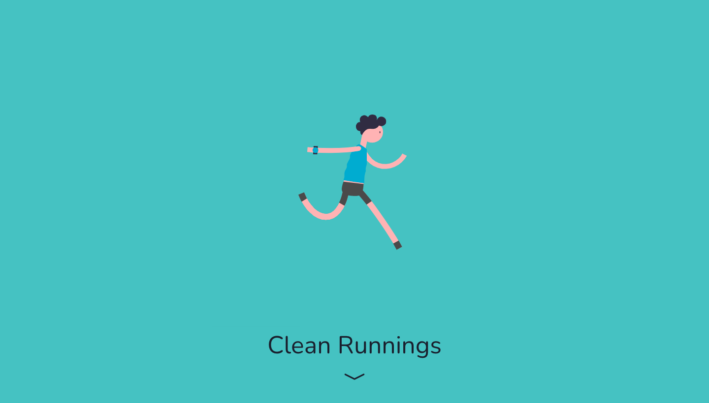
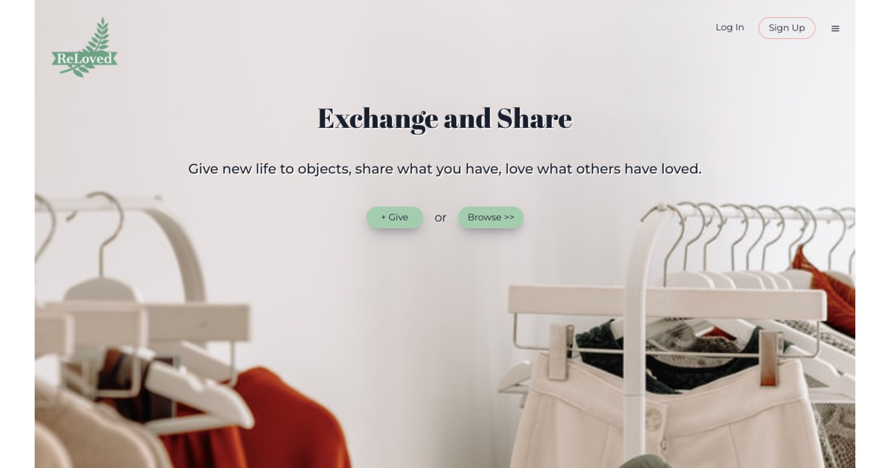
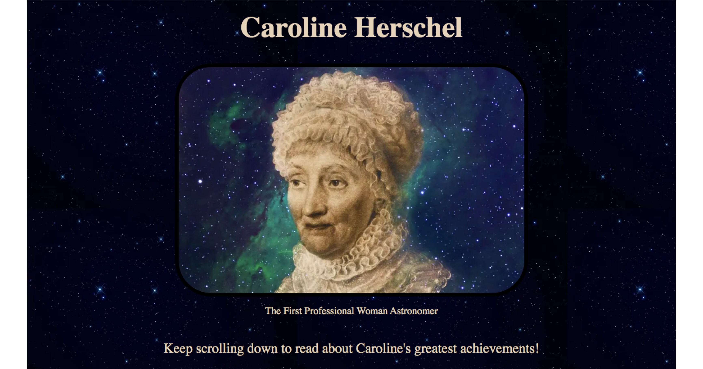

   
   <h2> Recent Work </h2>

  
  
  

  

    
    
  

   

  

  

    
    

  

   <h2>Languages & Tools</h2>

   

   <h3>Database

   

      
   
</h3>

   <h3>Frameworks

   

      
      
      
      
       
      
      
      
      
      
      
   
</h3>

  <h3>Testing

   

      
      
       
   
</h3>

 

   <h2>Quote From The Office</h2>

  <h3>As I'm a huge fan...</h3>
   
  <q>Bears, Beets, Battlestar Galactica.</q>

&mdash; <cite>Jim Halpert</cite>

   

